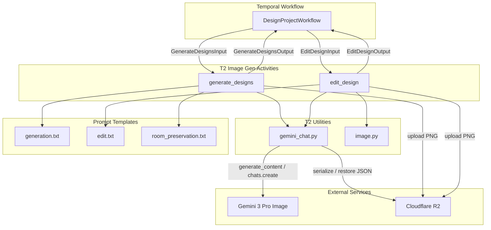
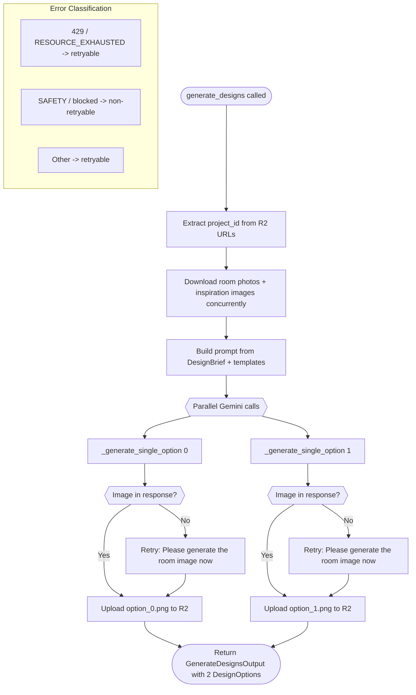
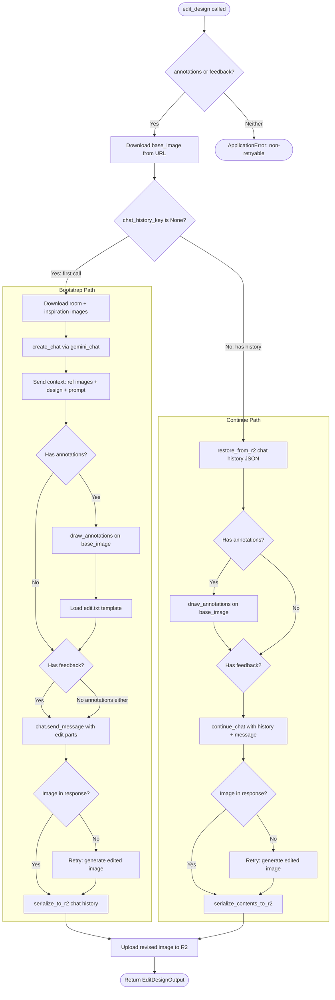
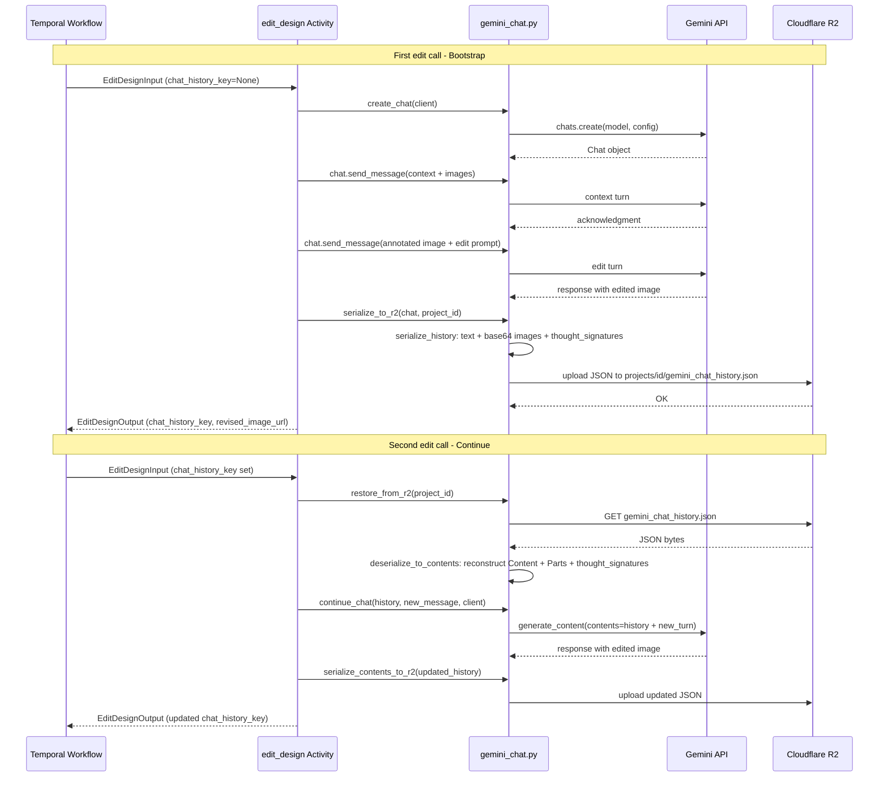

# T2 Image Generation Pipeline — Architecture Diagram

## 1. System Overview

Shows how T2 components connect to the Temporal workflow, Gemini API, and R2 storage.

## 2. generate_designs Flow

Shows the standalone generation path: room photos + brief produce 2 parallel design options.

## 3. edit_design Flow

Shows the branching logic: bootstrap new chat vs continue from R2 history.

## 4. Chat History Serialization Round-Trip

Shows how multi-turn Gemini chat state survives between stateless Temporal activity calls.

## Legend

| Component | File | Purpose |
|-----------|------|---------|
| generate_designs | `activities/generate.py` | 2 parallel standalone Gemini calls, no chat |
| edit_design | `activities/edit.py` | Bootstrap or continue multi-turn chat |
| gemini_chat.py | `utils/gemini_chat.py` | Chat create, serialize, restore, continue |
| image.py | `utils/image.py` | Draw numbered circle annotations on images |
| generation.txt | `prompts/generation.txt` | Initial generation prompt template |
| edit.txt | `prompts/edit.txt` | Annotation edit prompt template |
| room_preservation.txt | `prompts/room_preservation.txt` | Shared preservation clause |
