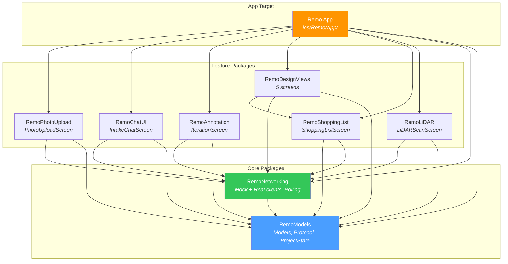
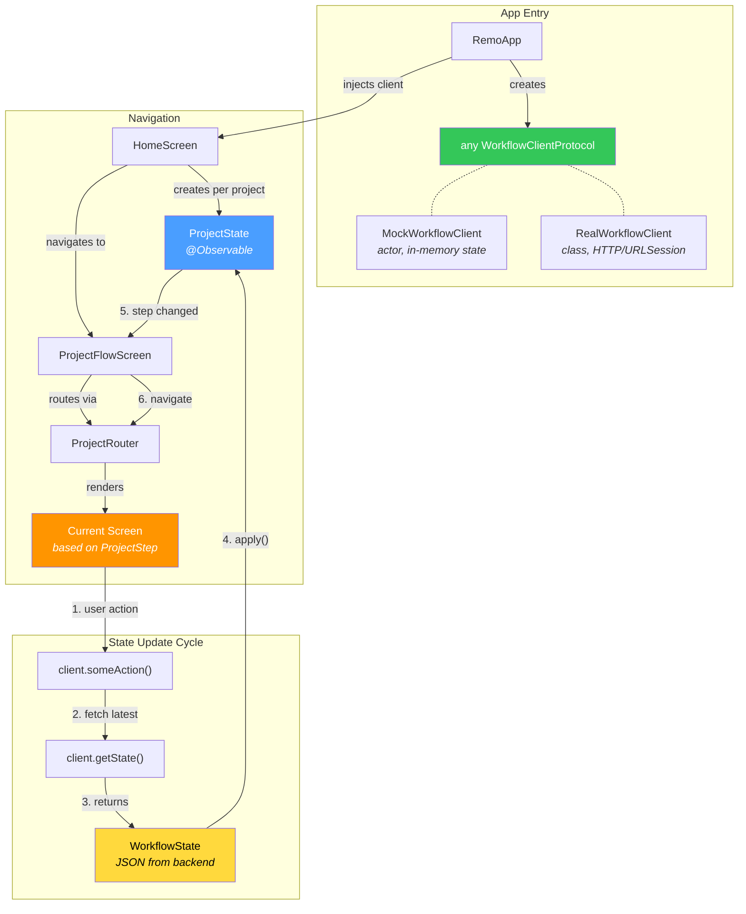
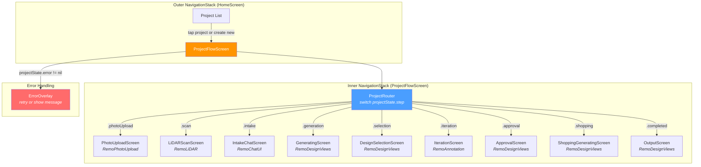
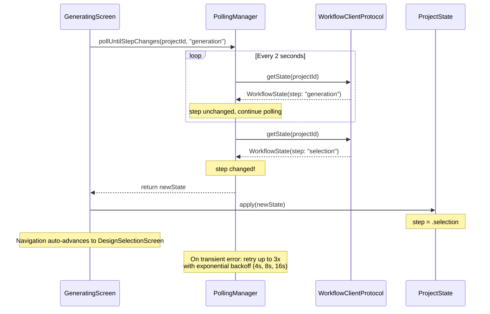
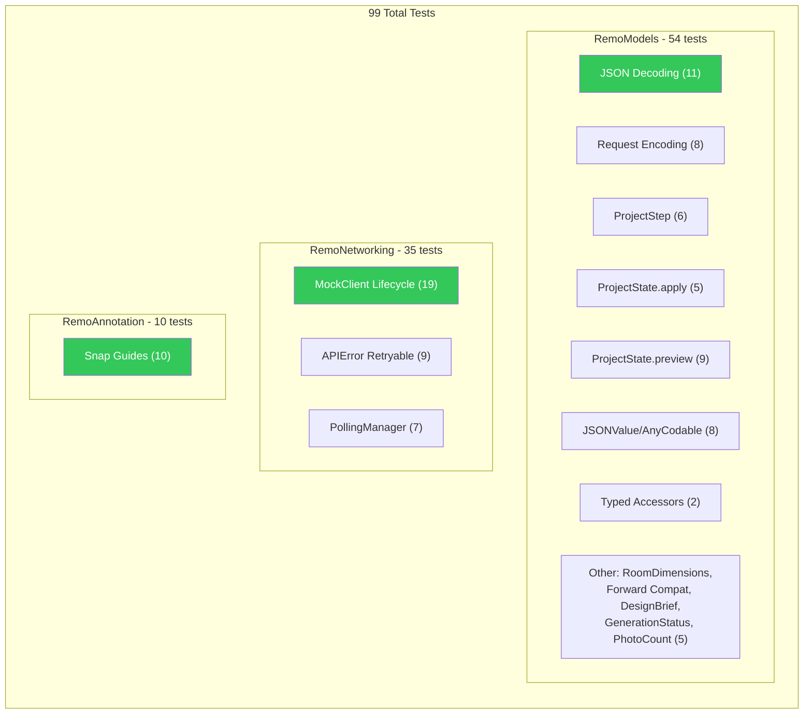

# iOS Architecture — Remo

Visual guide to the T1 iOS app architecture. All diagrams are Mermaid.

## 1. SPM Package Dependency Graph

## 2. Project Workflow — Step-by-Step Flow

This shows the **real backend** flow. The mock client has shortcuts noted below.

```mermaid
flowchart LR
    P["photos<br/>PhotoUploadScreen"] -->|"2+ room photos"| S["scan<br/>LiDARScanScreen"]
    S -->|"upload or skip"| I["intake<br/>IntakeChatScreen"]
    I -->|"confirm or skip"| G["generation<br/>GeneratingScreen"]
    G -->|"polling: step changes"| SE["selection<br/>DesignSelectionScreen"]
    SE -->|"select option"| IT["iteration<br/>IterationScreen"]
    IT -->|"submit edit"| IT
    IT -->|"5 rounds hit"| A["approval<br/>ApprovalScreen"]
    IT -.->|"approve early"| C
    A -->|"approve"| SH["shopping<br/>ShoppingGeneratingScreen"]
    SH -->|"polling: step changes"| C["completed<br/>OutputScreen"]

    SE -.->|"start over"| I

    style P fill:#ff6b6b,color:#fff
    style S fill:#ffa07a,color:#fff
    style I fill:#ffd93d,color:#000
    style G fill:#a8e6cf,color:#000
    style SE fill:#6bcb77,color:#fff
    style IT fill:#4d96ff,color:#fff
    style A fill:#9b59b6,color:#fff
    style SH fill:#e056a0,color:#fff
    style C fill:#2ecc71,color:#fff
```

**Mock client shortcuts:** In P1 mock, `confirmIntake`/`skipIntake` skip `generation` and go directly to `selection`. `approveDesign` goes directly to `completed`, skipping `shopping`. The real backend will use `generation` and `shopping` as async polling steps.

## 3. Data Flow — Protocol Injection and State Updates

## 4. Navigation Architecture — Two-Level NavigationStack

## 5. Polling Pattern — Async Step Transitions

## 6. Test Coverage Map

## 7. Key Design Decisions

| Decision | Rationale |
|----------|-----------|
| `@Observable` (not `ObservableObject`) | iOS 17+ only; simpler, no `@Published` needed |
| `actor MockWorkflowClient` | Compile-time data race safety for mutable in-memory state |
| Protocol in `RemoModels` (not `RemoNetworking`) | Avoids circular dependency; views import models, not networking |
| `ProjectStep.Comparable` via ordinal | Enables `<` ordering for navigation guards and sorting |
| `JSONValue` (not `Any`) | Type-safe recursive JSON for LiDAR wall/opening data |
| Two-level `NavigationStack` | Outer: project list. Inner: step flow. Prevents nav corruption |
| Polling (not SSE) | Simpler for MVP; backend returns full state each time |
| `wrapErrors` in RealWorkflowClient | Single place to map URLError/DecodingError to typed `APIError` |
