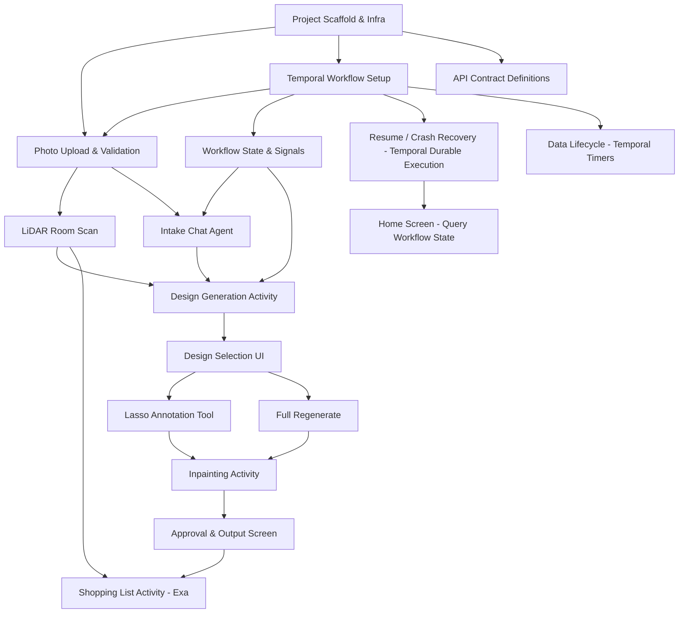

# Remo MVP: Feasibility Assessment & Build Sequence

> **Date**: 2026-02-10
> **Input**: `specs/PRODUCT_SPEC.md` v1.0
> **Scope**: Hackathon MVP

---

## 1. Critical Path Analysis

### Dependency Graph (Mermaid)



### Dependency Chain (Linear Critical Path)

```
Scaffold → Photo Upload → Intake Chat → Design Generation → Design Selection
  → Lasso Annotation → Revision Pipeline → Approval → Shopping List
```

**What must be built first:**
1. **Project scaffold + Temporal infrastructure** — everything depends on this. The Temporal workflow definition is the backbone; all step transitions, state persistence, and async job orchestration run through it.
2. **Photo upload + validation** — the entry point for all user data; generation can't happen without room photos. Photo upload is a signal to the workflow; validation is an activity.
3. **Temporal workflow core** — replaces custom data layer / state machine. The workflow definition encodes the step sequence (photos → scan → intake → generation → selection → iteration → approval → shopping). Each step is a workflow state waiting for a signal from the iOS client. No custom checkpoint/resume logic needed.
4. **Design generation pipeline** — the core AI feature; highest technical risk, must be proven early. Modeled as a Temporal activity with retry policies.

**What blocks what:**
- Photo upload blocks: LiDAR, Intake, Generation (no photos = nothing to work with)
- Design generation blocks: Lasso, Full Regenerate, Approval (no image = nothing to iterate on)
- Approval blocks: Shopping list (no approved design = nothing to match products against)
- LiDAR blocks: dimension-aware features in generation and shopping list (but can be stubbed with "no scan" path)

**What can be deferred or stubbed:**
- LiDAR: the entire "without LiDAR" path is well-specified; dimension features can be added after the core pipeline works
- Intake Chat: can start with a minimal version (hardcoded Quick Intake with 3 fixed questions) before building the adaptive agent
- Shopping List: can be built last since it only activates after approval

---

## 2. Risk Assessment

| Risk Area | Rating | Rationale | Mitigation |
|-----------|--------|-----------|------------|
| **Photorealistic image generation quality** | **HIGH** | Core value prop depends on generated images looking like the user's actual room. Current models (GPT-4o image gen, Stable Diffusion XL, Flux) can produce room images but struggle with: preserving exact room architecture from input photos, maintaining camera angle consistency, making edits look natural. This is the make-or-break feature. | Prototype generation early (day 1-2). Test multiple models. Accept "good enough" for MVP — slightly stylized is OK if it conveys the design intent. Consider img2img approaches (ControlNet + reference image) for better architectural preservation. |
| **Lasso inpainting accuracy** | **HIGH** | Editing specific regions while preserving everything else is state-of-the-art inpainting territory. Challenges: seamless boundary blending, maintaining lighting consistency, handling complex region shapes. Multiple regions per pass adds complexity. | Use mask-based inpainting (DALL-E edit API or Stable Diffusion inpainting). Process regions sequentially if needed. Accept slight artifacts at region boundaries for MVP. Limit to 3 regions per revision (already spec'd). |
| **LiDAR integration complexity** | **MEDIUM** | Apple's RoomPlan API handles the heavy lifting. Main challenges: extracting usable dimension data, mapping 3D geometry to 2D design constraints, handling edge cases (partial scans, unusual room shapes). | Use RoomPlan API directly — it outputs structured room geometry. For MVP, extract only wall lengths, floor area, and ceiling height. Stub with "no scan" path first. |
| **Chat agent reliability** | **MEDIUM** | Intake agent needs to be adaptive (skip covered domains, follow up on unexpected topics), produce structured output (Design Brief), and handle numbered quick-reply UX. Risk of hallucination, losing track of covered domains, or producing malformed briefs. | Use a strong LLM (Claude or GPT-4) with a well-structured system prompt. Define the Design Brief schema strictly. Validate output before passing to generation. Quick Intake (3 questions) is lower risk than Open Conversation — ship Quick first. |
| **Shopping list product match quality** | **MEDIUM** | Exa API search quality for specific furniture/decor is unproven at scale. Risks: irrelevant results, broken links, missing prices, products from low-quality retailers. Dimension matching adds another failure mode. | Test Exa API early with representative queries. Build the fallback (Google Shopping search link) from day 1. Accept "Close match" labels for imperfect matches. Don't show low-confidence results (already spec'd <0.5 threshold). |
| **Resume / crash recovery** | **LOW** | **Temporal handles this natively.** Workflow state is durably persisted by Temporal. If the app crashes or the user leaves, the workflow simply pauses at the current signal-wait point. When the user reopens the app, the iOS client queries the workflow state (via Temporal query) and resumes from exactly where it left off. No custom checkpoint logic needed. Remaining risk is limited to restoring fine-grained iOS UI state (scroll position, partial form input) which Temporal doesn't cover. | Use Temporal queries to expose `current_step` and accumulated data (photos, brief, images). iOS client reconstructs UI state from the query response. Accept that some transient UI state (scroll position) may not restore perfectly. |
| **End-to-end latency** | **MEDIUM** | Photo upload → validation → generation → shopping list involves multiple AI calls and image processing steps. Each generation could take 10-30 seconds. Shopping list involves N Exa API calls (one per identified item). Total time from photo to shopping list could exceed 5 minutes. | Show progress indicators at every step. Make generation async with push notification when done. Parallelize Exa queries for shopping list. Accept that this is not a "real-time" experience — users expect some wait for AI. |

---

## 3. MVP Scoping

### Absolute Minimum Viable Demo

The value prop is: **"Photo your room -> see it redesigned -> get a shopping list of real products."**

Minimum to demo this:

1. Upload 1-2 room photos (skip validation beyond basic checks)
2. Skip LiDAR entirely
3. Quick Intake (3 questions, hardcoded)
4. Generate **1 design option** (not 2)
5. **0 iteration rounds** (no lasso, no regenerate — just show the generated design)
6. Approve immediately
7. Shopping list with 3-5 key items via Exa

This strips out ~60% of the spec but proves the core value prop.

### Recommended MVP (Hackathon-Realistic)

Keep the full pipeline but simplify each step:

| Feature | Full Spec | Simplified MVP | Effort Saved |
|---------|-----------|----------------|--------------|
| Room photos | 2 required, validated | 2 required, basic validation (resolution only) | ~30% of validation work |
| Inspiration photos | Up to 3 with notes | Up to 3 with notes (keep — low effort, high value) | None |
| LiDAR | Full RoomPlan integration | **Stub**: show the option, capture scan data, but don't use it for generation or shopping. Display "Scan captured" confirmation. Wire in dimension-aware features post-MVP. | ~70% of LiDAR effort |
| Intake Chat | Quick/Full/Open/Skip with adaptive agent | **Quick Intake only** (3 fixed questions with numbered replies). No adaptive skipping, no Open Conversation. | ~50% of intake effort |
| Design Generation | 2 options, side-by-side/swipeable | **2 options, swipeable only** (skip side-by-side layout) | ~20% of UI effort |
| Lasso Annotation | Full lasso tool with 3 regions, editor, reordering | **Full lasso tool** (this is core — don't cut) but simplify: skip reordering, skip chip collision avoidance | ~20% of lasso effort |
| Full Regenerate | Text feedback + regenerate | Keep (low effort on top of generation pipeline) | None |
| Shopping List | Exa search, fit badges, grouping, confidence scoring | **Exa search + basic card display**. Skip fit badges, skip grouping, skip confidence labels. Show all results above threshold. | ~40% of shopping effort |
| Resume | Full crash recovery at exact step | **Free via Temporal**: workflow pauses at signal-wait points; iOS queries workflow state to resume. No custom checkpointing. | ~90% of resume effort (Temporal provides it) |
| Home Screen | Pending projects list with thumbnails | **Simplified**: "New Design" button + at most 1 pending project indicator | ~30% of home effort |

### What to Cut Entirely for Hackathon

- Side-by-side design comparison view (swipeable only)
- LiDAR dimension-aware generation and shopping
- Open Conversation intake mode
- Full Intake (10 questions)
- Lasso region reordering
- Revision history browser (swipe back through revisions)
- Shopping list product grouping by room area
- Fit badges on product cards
- Share / Copy All on shopping list
- ~~Data purge timers (24h/48h)~~ — **now trivial via Temporal timers** (keep in scope)

---

## 4. Build Sequence

### Phase 0: Project Scaffold & Infrastructure (2-3 dev-days)

**Goal**: Everyone can start building independently. Temporal is running and a skeleton workflow exists.

- [ ] iOS project setup (Xcode, SwiftUI, folder structure, navigation skeleton)
- [ ] Backend project setup (Python FastAPI, folder structure)
- [ ] **Temporal infrastructure**: Temporal server (Temporal Cloud or self-hosted via docker-compose for dev), Python SDK (`temporalio`), worker process scaffold
- [ ] **Temporal workflow definition**: `DesignProjectWorkflow` skeleton with step-state enum (photos → scan → intake → generation → selection → iteration → approval → shopping), signal handlers for each step transition, and a query handler returning current state
- [ ] **Temporal activity stubs**: `validate_photo`, `generate_designs`, `generate_inpainting`, `generate_shopping_list` — each with retry policies defined but returning mock data
- [ ] API contract definitions (OpenAPI/Swagger for all endpoints)
- [ ] CI pipeline (build + lint for both iOS and backend)
- [ ] Development environment: local backend + Temporal dev server, mock activity responses
- [ ] Shared data models: Project, Photo, DesignBrief, GeneratedImage, ShoppingItem
- [ ] API gateway: thin FastAPI layer that starts workflows (`POST /projects`), sends signals (`POST /projects/{id}/photos`), and queries state (`GET /projects/{id}`)

**Deliverable**: iOS app launches, creates a project (starts a Temporal workflow), and can query workflow state. Temporal dev server running. Activities return mock responses.

### Phase 1: Core Pipeline (5-7 dev-days)

**Goal**: Photo → Generation → Output works end-to-end, orchestrated by Temporal.

- [ ] **Photo upload UI** (camera + camera roll picker, 2 required + 3 optional inspiration)
- [ ] **Photo upload signal** (`POST /projects/{id}/photos` → FastAPI sends Temporal signal `photos_uploaded` with S3 URLs)
- [ ] **`validate_photo` activity** (resolution check + room detection via vision model; Temporal retry policy: 3 attempts, 5s backoff)
- [ ] **Intake Chat — Quick mode** (3 fixed questions, numbered replies, Design Brief output)
- [ ] **Chat UI** (message bubbles, numbered option chips, text input with dictation)
- [ ] **`generate_designs` activity** (assemble prompt from photos + brief, call image generation API, return 2 options; retry policy: 2 attempts, 30s timeout per attempt, non-retryable on model content-policy errors)
- [ ] **Generation flow**: workflow receives `brief_confirmed` signal → executes `generate_designs` activity → stores result in workflow state → iOS polls via query
- [ ] **Design selection UI** (swipeable 2 options, select + confirm)
- [ ] **Basic approval flow** (approve signal → workflow transitions to approved state)
- [ ] **Output screen** (display final image, save to photos button)

**Deliverable**: A user can upload photos, answer 3 questions, see 2 AI-generated room designs, pick one, and save the image. The entire flow is a single Temporal workflow execution.

### Phase 2: Iteration (4-5 dev-days)

**Goal**: Users can refine the selected design. Iteration loop modeled as a Temporal workflow loop.

- [ ] **Lasso drawing tool** (freehand closed loop, auto-close, minimum area check, self-intersection check)
- [ ] **Region rendering** (outline + number chip placement)
- [ ] **Region Editor** (action selector, instruction text, avoid tokens, style nudge chips)
- [ ] **Edit List** (bottom sheet on iPhone, side panel on iPad — numbered list, select, delete)
- [ ] **`generate_inpainting` activity** (base image + mask + edit instructions → revised image; retry policy: 2 attempts, 45s timeout)
- [ ] **Revision signal**: `POST /projects/{id}/revisions` → FastAPI sends `revision_requested` signal with regions/feedback payload → workflow executes `generate_inpainting` activity → stores revision in workflow state
- [ ] **Full Regenerate UI + signal** (text feedback → `regenerate_requested` signal → `generate_designs` activity with feedback directive)
- [ ] **Iteration counter** (tracked in workflow state; workflow enforces max 5 — rejects signals beyond limit)
- [ ] **Overlap detection** (prevent overlapping lasso regions — client-side validation)

**Deliverable**: Users can draw on the image, describe changes, and get a revised version. Up to 5 rounds. Workflow state tracks all revisions durably.

### Phase 3: Shopping List & Polish (3-4 dev-days)

**Goal**: The complete value prop works. Temporal timers handle data lifecycle.

- [ ] **`generate_shopping_list` activity** (analyze approved image → extract items → Exa search per item → score results; retry: 3 attempts)
- [ ] **Shopping list flow**: workflow receives `approve` signal → executes `generate_shopping_list` activity → stores results → starts Temporal timer for 24h grace period
- [ ] **Product card UI** (image, name, retailer, price, dimensions, "Why this match", Buy button)
- [ ] **Confidence filtering** (hide low-confidence, label medium-confidence)
- [ ] **Fallback** (Google Shopping link when Exa returns nothing)
- [ ] **Total estimated cost** display
- [ ] **Intake Chat — Full mode** (10 questions, adaptive domain tracking)
- [ ] **LiDAR integration** (RoomPlan API, scan UI, capture geometry; scan data sent via `scan_completed` signal)
- [ ] **Home screen** (pending project list via Temporal workflow list/query, thumbnails, resume badges)
- [ ] **Data lifecycle timers**: 24h post-approval grace period and 48h abandonment purge — both as Temporal timers that trigger a `purge_project` activity (delete S3 assets, mark workflow complete)

**Deliverable**: Full pipeline from photo to shopping list. Data lifecycle is automated via Temporal timers. Home screen queries Temporal for active workflows.

### Phase 4: Resilience & Edge Cases (1-2 dev-days)

**Goal**: App doesn't break in the real world. (Reduced from 2-3 days because Temporal handles the hardest resilience problems.)

- [ ] ~~**Resume flow**~~ — **handled by Temporal** (workflow state is durable; iOS queries workflow on reopen)
- [ ] **Error states** (network loss on iOS side, LiDAR failure — per spec; generation failures are retried by Temporal activity retry policies)
- [ ] **Validation edge cases** (blurry photos, people in photos, low-res images)
- [ ] **Background generation** — Temporal activities run server-side regardless of iOS app state; iOS just polls/queries on return
- [ ] ~~**Data lifecycle**~~ — **handled by Temporal timers** (Phase 3)
- [ ] **Onboarding tooltip** (first-use data policy notification)
- [ ] **Accessibility** (WCAG AA contrast for lasso outlines, VoiceOver support for key flows)
- [ ] **LiDAR dimension-aware features** (dimension filtering in shopping, fit badges)
- [ ] **Temporal observability**: workflow metrics dashboard, failed activity alerts, worker health checks

**Deliverable**: Production-ready MVP. Temporal provides crash recovery, retry, and data lifecycle out of the box.

---

## 5. Parallelization Plan

Three developers can work simultaneously with minimal blocking:

### Developer A: iOS / Frontend

| Phase | Tasks | Blocked By |
|-------|-------|------------|
| 0 | Xcode project setup, navigation skeleton, shared models | None |
| 1 | Photo upload UI, camera/roll picker, validation UI, chat UI, numbered option chips, design selection (swipeable), approval screen, output screen (save to photos) | API contracts (Phase 0) |
| 2 | Lasso drawing tool, region rendering, number chips, Region Editor form, Edit List (bottom sheet), iteration counter UI, Full Regenerate UI | None (can build against mock API) |
| 3 | Product card UI, shopping list display, total cost, LiDAR scan UI (RoomPlan), home screen with pending projects | Shopping list API schema |
| 4 | Resume UI, error state UI, background generation handling, onboarding tooltip, accessibility | Backend resume endpoints |

### Developer B: Backend / AI Pipeline + Temporal

| Phase | Tasks | Blocked By |
|-------|-------|------------|
| 0 | Backend project setup, **Temporal server (dev docker-compose or Temporal Cloud)**, Temporal worker scaffold, `DesignProjectWorkflow` skeleton with signal/query handlers, S3/storage setup | None |
| 1 | `validate_photo` activity, `generate_designs` activity (prompt assembly, model API calls, image storage), photo upload signal handler, generation flow in workflow, FastAPI signal/query endpoints | None |
| 2 | `generate_inpainting` activity (mask generation from lasso coordinates, inpainting model API), revision signal handler, iteration counter enforcement in workflow | Generation activity (Phase 1) |
| 3 | `generate_shopping_list` activity (image analysis → item extraction → Exa queries → result scoring), Exa API integration, confidence scoring, fallback generation, **Temporal timers for 24h/48h data lifecycle**, `purge_project` activity | Exa API access |
| 4 | Temporal observability (metrics, alerts, dead-letter handling), worker scaling config, activity timeout tuning | None |

### Developer C: Full-Stack / Integration

| Phase | Tasks | Blocked By |
|-------|-------|------------|
| 0 | API contract definitions (OpenAPI), shared data models, CI pipeline, dev environment setup | None |
| 1 | Intake chat agent (system prompt, question planning, adaptive behavior, Design Brief schema), intake signal/query flow in workflow, integration testing (photo → generation end-to-end via Temporal) | None |
| 2 | Integration: lasso coordinates → inpainting activity, overlay image generation (regions rendered on image for model input), end-to-end iteration testing via Temporal signals | Lasso UI (Dev A) + Inpainting activity (Dev B) |
| 3 | LiDAR data processing (RoomPlan geometry → dimensions), dimension-aware shopping queries, fit badge computation, Full Intake agent (10 questions, adaptive) | LiDAR UI (Dev A) + Shopping activity (Dev B) |
| 4 | End-to-end testing, **Temporal workflow replay testing**, performance optimization, demo preparation | All prior phases |

### Key Sync Points

1. **End of Phase 0**: All three devs align on API contracts and data models
2. **End of Phase 1**: First end-to-end demo (photo → generation → display)
3. **Mid Phase 2**: Lasso coordinates format agreed between iOS and backend
4. **End of Phase 3**: Full pipeline demo (photo → design → shopping list)

---

## 6. Integration Points (API Contracts)

These contracts should be defined in Phase 0 and are the handshake between iOS and backend. The FastAPI layer is a thin gateway — it translates REST calls into Temporal signals and queries.

### Architecture: iOS ↔ FastAPI ↔ Temporal

```
iOS App  ──HTTP──▶  FastAPI Gateway  ──signal──▶  Temporal Workflow
                         │                              │
                    query ◀──────────────────────────────┘
                         │
iOS App  ◀──HTTP──┘  (returns workflow state)
```

**Pattern**: Every user action is a Temporal **signal**. Every state read is a Temporal **query**. The FastAPI gateway does no orchestration logic — it just translates HTTP to Temporal SDK calls.

### Core Endpoints

```
POST   /projects                           → { project_id }
  # Starts a new Temporal workflow with workflow_id = project_id

GET    /projects/{id}                       → { status, current_step, data }
  # Temporal query: returns full workflow state (current step, photos, brief, images, etc.)

DELETE /projects/{id}                       → 204
  # Sends "cancel" signal to workflow; workflow runs purge activity then completes

POST   /projects/{id}/photos               → { photo_id, validation_result }
  Body: multipart/form-data (image + type: "room" | "inspiration" + note?)
  # Uploads to S3, then sends "photos_uploaded" signal with S3 URLs
  # Workflow executes validate_photo activity and stores result in state

POST   /projects/{id}/scan                  → { scan_id }
  Body: RoomPlan geometry data (JSON)
  # Sends "scan_completed" signal with geometry payload

POST   /projects/{id}/intake/message        → { agent_response, brief? }
  Body: { message, selected_option? }
  # Sends "intake_message" signal; workflow processes via chat agent
  # When intake completes, workflow stores DesignBrief in state

GET    /projects/{id}/brief                 → { DesignBrief }
  # Temporal query: returns brief from workflow state

POST   /projects/{id}/generate              → 202 Accepted
  # Sends "generate_requested" signal
  # Workflow executes generate_designs activity (may take 30-60s)
  # iOS polls GET /projects/{id} until current_step changes to "selection"

POST   /projects/{id}/select                → 200
  Body: { selected_option_index }
  # Sends "option_selected" signal

POST   /projects/{id}/revisions             → 202 Accepted
  Body: { regions: [...] } | { feedback_text }
  # Sends "revision_requested" signal with payload
  # Workflow executes generate_inpainting activity
  # iOS polls GET /projects/{id} until revision appears in state

POST   /projects/{id}/approve               → 200
  # Sends "design_approved" signal
  # Workflow executes generate_shopping_list activity, then starts 24h timer

GET    /projects/{id}/shopping-list         → { status, items: ShoppingItem[] }
  # Temporal query: returns shopping list from workflow state (available after approval)
```

### Key Data Models

```typescript
interface Project {
  id: string
  status: "active" | "approved" | "purged"
  current_step: "photos" | "scan" | "intake" | "generation" | "selection" | "iteration" | "approved"
  created_at: ISO8601
  updated_at: ISO8601
  photos: Photo[]
  scan?: ScanData
  brief?: DesignBrief
  selected_option_index?: number
  iterations_used: number
  approved_image_url?: string
}

interface Photo {
  id: string
  type: "room" | "inspiration"
  url: string
  note?: string  // inspiration only
  validation: { passed: boolean, failures: string[] }
}

interface DesignBrief {
  room_type: string
  occupants: string
  pain_points: string[]
  keep_items: string[]
  style_profile: {
    lighting: string
    colors: string[]
    textures: string[]
    clutter_level: "minimal" | "curated" | "layered"
    mood: string
  }
  constraints: string[]
  inspiration_notes: { photo_index: number, note: string, agent_clarification: string }[]
}

interface ShoppingItem {
  id: string
  category: string
  product_name: string
  retailer: string
  price: number
  currency: string
  dimensions?: string
  image_url: string
  product_url: string
  match_reason: string
  confidence: number  // 0.0 - 1.0
  fit_status?: "fits" | "tight" | "unknown"  // LiDAR only
}

interface LassoRegion {
  region_id: number
  polygon: [number, number][]  // normalized coordinates (0-1)
  action: "replace" | "remove" | "change_finish" | "resize" | "reposition"
  instruction: string
  avoid: string[]
  constraints: string[]
}
```

### Temporal Workflow State (returned by query)

Instead of a separate async job pattern, the iOS client polls `GET /projects/{id}` which performs a Temporal query. The workflow state includes everything the iOS client needs to render the current step.

```typescript
interface WorkflowState {
  project_id: string
  status: "active" | "generating" | "approved" | "purging" | "completed"
  current_step: "photos" | "scan" | "intake" | "generation" | "selection" | "iteration" | "approved"
  photos: Photo[]
  scan?: ScanData
  brief?: DesignBrief
  design_options?: { image_url: string, caption: string }[]
  selected_option_index?: number
  iterations_used: number
  max_iterations: 5
  revisions: { image_url: string, edit_payload: any, timestamp: ISO8601 }[]
  current_image_url?: string
  approved_image_url?: string
  shopping_list?: { status: "generating" | "ready", items: ShoppingItem[] }
  error?: string  // set if the last activity failed; cleared on retry
}
```

**Polling pattern**: iOS polls `GET /projects/{id}` at 2-second intervals when `status` is `"generating"`. When `current_step` changes or `shopping_list.status` becomes `"ready"`, the client updates the UI. No separate job IDs needed — all state lives in the workflow.

**Temporal signals** (sent by FastAPI to the workflow):

| Signal Name | Payload | Triggers |
|-------------|---------|----------|
| `photos_uploaded` | `{ photos: Photo[] }` | `validate_photo` activity per photo |
| `scan_completed` | `{ scan_data: ScanData }` | Stores scan data in state |
| `intake_message` | `{ message: string, selected_option?: number }` | Chat agent processing |
| `brief_confirmed` | `{ brief: DesignBrief }` | `generate_designs` activity |
| `generate_requested` | `{}` | `generate_designs` activity (for "Start Over") |
| `option_selected` | `{ index: number }` | Stores selection, transitions to iteration |
| `revision_requested` | `{ regions: LassoRegion[] }` or `{ feedback: string }` | `generate_inpainting` activity |
| `design_approved` | `{}` | `generate_shopping_list` activity + 24h timer |
| `cancel` | `{}` | `purge_project` activity + workflow completion |

**Temporal timers**:

| Timer | Duration | Triggers |
|-------|----------|----------|
| Post-approval grace | 24 hours after `design_approved` | `purge_project` activity |
| Abandonment | 48 hours after last signal received | `purge_project` activity |

---

## 7. Timeline Estimate

| Phase | Description | Dev-Days (per developer) | Calendar Days (3 devs parallel) | Cumulative | Temporal Impact |
|-------|-------------|--------------------------|--------------------------------|------------|----------------|
| **0** | Scaffold & Infra + Temporal | 2-3 | 1-2 | Day 1-2 | +0.5 days for Temporal setup, offset by simpler backend scaffold (no Celery/Redis/custom state) |
| **1** | Core Pipeline | 4-6 | 2-3 | Day 3-5 | -1 day: no custom async job system; activities replace ad-hoc pipeline code |
| **2** | Iteration (Lasso + Regenerate) | 3-4 | 2-3 | Day 6-8 | -0.5 days: iteration loop is a workflow loop, no custom counter persistence |
| **3** | Shopping List & Polish | 3-4 | 2-3 | Day 9-11 | -0.5 days: data lifecycle timers are one-line `workflow.sleep()` calls |
| **4** | Resilience & Edge Cases | 1-2 | 1 | Day 12 | **-1 to -2 days**: resume, retry, and purge are handled by Temporal. Only iOS-side error UI and accessibility remain. |

**Total estimate: 12-13 calendar days** with 3 developers working in parallel. (Down from 14-16 without Temporal.)

### Hackathon Accelerated Timeline (Minimum Viable Demo)

If the hackathon is 2-3 days, target the Absolute Minimum path from Section 3:

| Day | Focus | Deliverable |
|-----|-------|-------------|
| **Day 1** | Scaffold + Photo upload + Generation pipeline proof-of-concept | Can upload a photo and get a generated image back (even if rough) |
| **Day 2** | Quick Intake chat + Design selection UI + Basic lasso (1 region only) + Approval screen | End-to-end flow works: photo → questions → design → iterate → approve |
| **Day 3** | Shopping list (Exa integration) + Polish + Demo prep | Full value prop: photo → design → shopping list with real products |

### Key Milestones

1. **First generated image from a room photo** — proves the AI pipeline works (target: end of day 2-3)
2. **First successful inpainting edit** — proves iteration works (target: end of day 5-7)
3. **First real product match via Exa** — proves the shopping list works (target: end of day 8-10)
4. **End-to-end demo** — full flow from photo to shopping list (target: end of day 12-14)

---

## 8. Technical Stack Recommendations

| Layer | Recommendation | Rationale |
|-------|---------------|-----------|
| **iOS UI** | SwiftUI | Modern, declarative, faster to build. UIKit fallback for lasso drawing (Canvas/PencilKit). |
| **iOS Networking** | URLSession + async/await | Native, no dependencies. |
| **iOS LiDAR** | RoomPlan API | Apple's first-party room scanning framework. Outputs structured geometry. |
| **Backend API** | Python (FastAPI) | Thin gateway translating HTTP to Temporal signals/queries. Best ecosystem for AI/ML integration. |
| **Workflow Orchestration** | **Temporal** (Python SDK `temporalio`) | Durable execution for the project workflow. Handles crash recovery, retry, timers, and state persistence. Eliminates need for custom state machine, job queue, and checkpoint logic. |
| **Temporal Server** | Temporal Cloud (production) or `temporalite` / docker-compose (dev) | Temporal Cloud is zero-ops. For dev, `temporalite` is a single binary. Docker-compose for full setup with UI. |
| **Image Generation** | GPT-4o image generation (primary), Stable Diffusion via Replicate (fallback) | GPT-4o handles image editing well. Replicate provides inpainting models. |
| **Inpainting** | DALL-E edit API or Flux inpainting via Replicate | Mask-based editing with good boundary blending. |
| **Chat Agent** | Claude API (Anthropic) or GPT-4 | Strong instruction following for adaptive intake agent. |
| **Photo Validation** | Vision model (GPT-4o or Claude vision) | Room detection, people detection, quality assessment. |
| **Product Search** | Exa API | Real-time product search without maintaining a catalog. |
| **Storage** | S3 or Cloud Storage | Image and scan data storage. |
| **Database** | **None for MVP** — Temporal workflow state is the primary data store. Add PostgreSQL only if needed for cross-workflow queries (e.g., analytics). | Temporal stores all workflow state durably. The workflow state query returns everything the iOS client needs. No separate DB layer needed for core functionality. |
| **~~Job Queue~~** | ~~Celery + Redis~~ → **Temporal activities** | Temporal replaces the need for a separate job queue. Activities are retried, timed out, and tracked automatically. |
| **Hosting** | Railway or AWS (ECS for workers, API) + Temporal Cloud | FastAPI gateway + Temporal worker process. Temporal Cloud handles the server. |

### Why Temporal Simplifies the Architecture

| Concern | Without Temporal | With Temporal |
|---------|-----------------|---------------|
| **Workflow state** | Custom state machine + PostgreSQL + checkpoint logic | Workflow function — state is implicit in code execution position |
| **Crash recovery / resume** | Custom checkpoint-and-reload at every step boundary | Free — workflow replays from Temporal's event history |
| **Async jobs (generation)** | Celery + Redis + job status polling + dead-letter queue | Temporal activities with retry policies |
| **Data lifecycle timers** | Cron jobs + scheduler + database TTLs | `workflow.sleep(timedelta(hours=24))` — one line |
| **Retry / error handling** | Per-endpoint retry logic, idempotency keys, error state tracking | Activity retry policies (declarative: max attempts, backoff, timeout) |
| **Observability** | Custom logging, job status dashboards | Temporal Web UI — see every workflow execution, activity attempt, signal, and timer |

**Net effect**: Temporal eliminates ~40% of the custom backend code (state machine, job queue, resume logic, purge cron, retry handling) and replaces it with declarative workflow definitions and activity retry policies.

---

## 9. Key Risks & Mitigations Summary

| # | Risk | Impact | Likelihood | Mitigation |
|---|------|--------|------------|------------|
| 1 | Generated images don't look like the user's room | Fatal — breaks core value prop | Medium-High | Test generation models on day 1. Use img2img with strong conditioning. Accept "inspired by" rather than "photorealistic replica" for MVP. |
| 2 | Inpainting changes things outside the lasso region | High — breaks user trust | Medium | Use mask-based inpainting with explicit "preserve everything outside mask" instructions. Quality-test each model. |
| 3 | Exa API returns irrelevant products | Medium — degrades output quality | Medium | Build the Google Shopping fallback from day 1. Curate search queries carefully. Post-process results with LLM for relevance scoring. |
| 4 | End-to-end latency exceeds user patience | Medium — poor UX | Medium | Show progress indicators. Make each step feel productive. Consider pre-generating while user reviews options. |
| 5 | LiDAR integration takes longer than expected | Low — non-blocking | Low | LiDAR is additive. The entire app works without it. Stub and ship. |
| 6 | Temporal learning curve slows initial development | Low-Medium | Low-Medium | Temporal's Python SDK is straightforward. The workflow pattern maps directly to the product spec's step sequence. Invest 2-4 hours in the Temporal tutorial on day 1. The payoff (eliminating custom state machine, job queue, resume, and purge logic) far exceeds the learning cost. |
| 7 | Temporal workflow state grows too large | Low | Low | Workflow state includes image URLs (not image bytes). Actual images live in S3. Keep workflow state lightweight (<1MB). |

---

## 10. Temporal Workflow Design (Reference)

### Workflow Pseudocode

```python
@workflow.defn
class DesignProjectWorkflow:
    def __init__(self):
        self.state = WorkflowState(status="active", current_step="photos")

    @workflow.run
    async def run(self):
        # --- PHOTOS ---
        await workflow.wait_condition(lambda: self.state.photos_ready)
        for photo in self.state.pending_photos:
            result = await workflow.execute_activity(
                validate_photo, photo,
                start_to_close_timeout=timedelta(seconds=30),
                retry_policy=RetryPolicy(maximum_attempts=3)
            )
            self.state.update_photo_validation(photo.id, result)

        # --- SCAN (optional) ---
        self.state.current_step = "scan"
        # Wait for scan_completed or scan_skipped signal
        await workflow.wait_condition(lambda: self.state.scan_resolved)

        # --- INTAKE ---
        self.state.current_step = "intake"
        # Wait for brief_confirmed or intake_skipped signal
        # (intake messages handled by signal handler below)
        await workflow.wait_condition(lambda: self.state.brief_ready)

        # --- GENERATION ---
        self.state.current_step = "generation"
        self.state.status = "generating"
        options = await workflow.execute_activity(
            generate_designs,
            GenerateInput(photos=self.state.photos, brief=self.state.brief, scan=self.state.scan),
            start_to_close_timeout=timedelta(seconds=120),
            retry_policy=RetryPolicy(maximum_attempts=2)
        )
        self.state.design_options = options
        self.state.status = "active"

        # --- SELECTION ---
        self.state.current_step = "selection"
        await workflow.wait_condition(lambda: self.state.selected_option_index is not None)

        # --- ITERATION LOOP (max 5) ---
        self.state.current_step = "iteration"
        while self.state.iterations_used < 5:
            # Wait for revision_requested, regenerate_requested, or design_approved
            await workflow.wait_condition(lambda: self.state.has_pending_action)

            if self.state.pending_action == "approve":
                break
            elif self.state.pending_action == "revision":
                self.state.status = "generating"
                result = await workflow.execute_activity(
                    generate_inpainting,
                    self.state.revision_payload,
                    start_to_close_timeout=timedelta(seconds=120),
                    retry_policy=RetryPolicy(maximum_attempts=2)
                )
                self.state.apply_revision(result)
                self.state.status = "active"
            elif self.state.pending_action == "regenerate":
                # similar to above but calls generate_designs with feedback
                ...

            self.state.clear_pending_action()

        # --- APPROVAL ---
        self.state.current_step = "approved"
        self.state.status = "generating"  # generating shopping list
        shopping = await workflow.execute_activity(
            generate_shopping_list,
            ShoppingInput(image=self.state.current_image_url, brief=self.state.brief, scan=self.state.scan),
            start_to_close_timeout=timedelta(seconds=180),
            retry_policy=RetryPolicy(maximum_attempts=3)
        )
        self.state.shopping_list = shopping
        self.state.status = "approved"

        # --- DATA LIFECYCLE ---
        # 24-hour grace period, then purge
        await asyncio.sleep(timedelta(hours=24).total_seconds())
        await workflow.execute_activity(
            purge_project, self.state.project_id,
            start_to_close_timeout=timedelta(seconds=60)
        )
        self.state.status = "completed"

    # --- SIGNAL HANDLERS ---
    @workflow.signal
    async def photos_uploaded(self, photos: list[Photo]):
        self.state.pending_photos.extend(photos)
        self.state.photos_ready = True

    @workflow.signal
    async def scan_completed(self, scan_data: ScanData):
        self.state.scan = scan_data
        self.state.scan_resolved = True

    @workflow.signal
    async def scan_skipped(self):
        self.state.scan_resolved = True

    @workflow.signal
    async def intake_message(self, message: str, selected_option: int | None):
        # Process via chat agent (could be an activity)
        ...

    @workflow.signal
    async def brief_confirmed(self, brief: DesignBrief):
        self.state.brief = brief
        self.state.brief_ready = True

    @workflow.signal
    async def option_selected(self, index: int):
        self.state.selected_option_index = index

    @workflow.signal
    async def revision_requested(self, payload):
        self.state.pending_action = "revision"
        self.state.revision_payload = payload

    @workflow.signal
    async def design_approved(self):
        self.state.pending_action = "approve"

    # --- QUERY HANDLER ---
    @workflow.query
    def get_state(self) -> WorkflowState:
        return self.state
```

This pseudocode maps 1:1 to the product spec's step sequence. Each `await workflow.wait_condition()` is a durable wait — if the worker crashes, Temporal replays the workflow from its event history and the wait resumes exactly where it left off.

---

*End of feasibility assessment.*
