# Architecture Diagrams

Mermaid diagrams for the Remo system. Renders on GitHub and in Obsidian.

## System Architecture

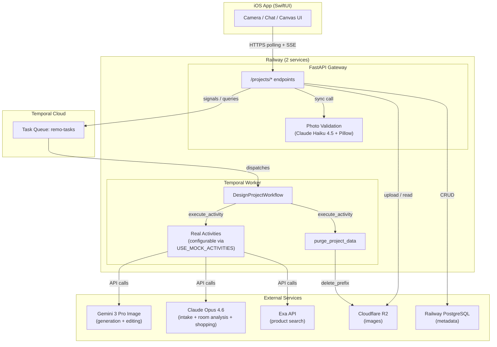

## Workflow State Machine

The `DesignProjectWorkflow` drives each design project through a linear pipeline with a restart loop from intake through iteration.

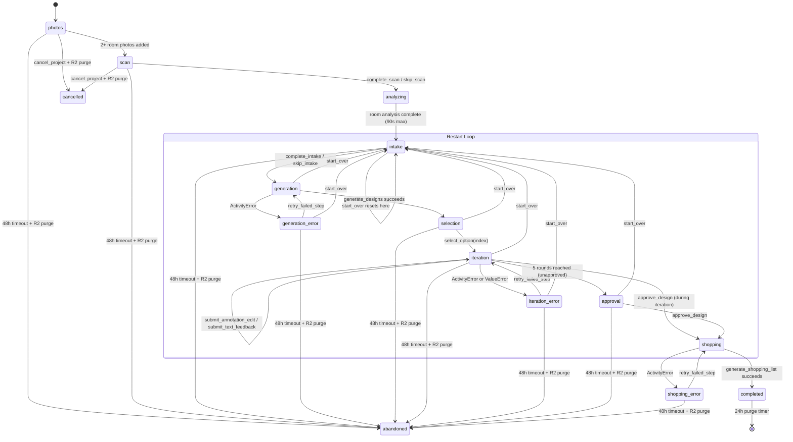

## Signal & Query Map

All interactions with the workflow happen via Temporal signals (fire-and-forget) and queries (synchronous read).

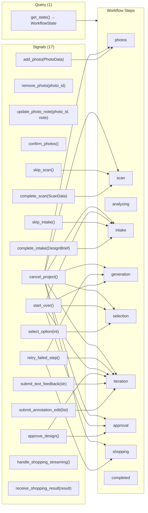

## API Endpoint Map

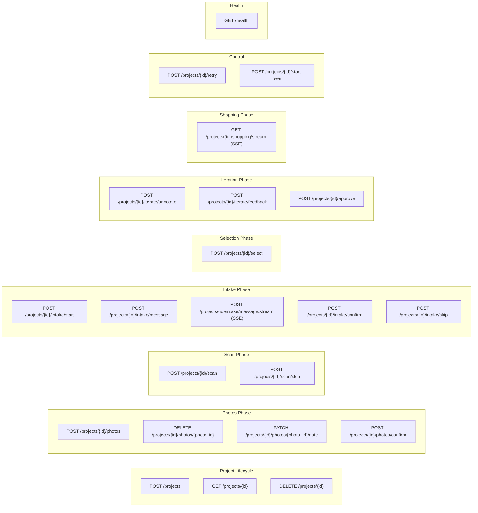

## Edit System (Annotation-First)

The iteration loop uses a single `edit_design` activity that accepts either annotation regions or text feedback. This replaces the previous dual-activity model (inpaint + regen).

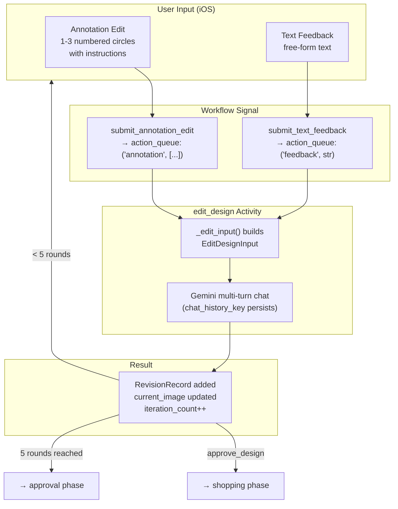

## Abandonment & Purge Mechanism

Every user-facing wait in the workflow uses `_wait()`, which wraps `workflow.wait_condition()` with a **48-hour abandonment timeout**. If the user takes no action for 48h at any phase, the workflow:

1. Runs `purge_project_data` (best-effort R2 cleanup via `delete_prefix`)
2. Raises `_AbandonedError`
3. Sets `step = "abandoned"` and the workflow completes

The 10 wait points that carry this timeout:

| Phase | Waiting for |
|-------|-------------|
| `photos` | 2+ room photos |
| `scan` | scan data or skip |
| `intake` | design brief or skip |
| `generation` (error) | retry or start_over |
| `selection` | option selected or start_over |
| `iteration` | edit action, approve, or start_over |
| `iteration` (ActivityError) | retry or start_over |
| `iteration` (ValueError) | retry or start_over |
| `approval` | approve or start_over |
| `shopping` (error) | retry |

Additionally, `cancel_project` triggers R2 purge immediately, and `completed` runs a 24h purge timer (not abandonment — the workflow reached success).

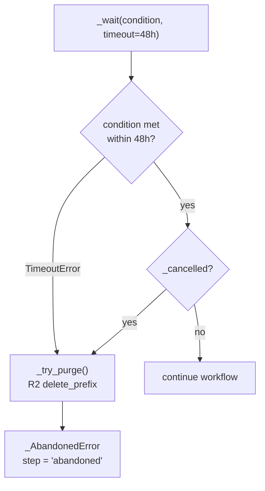

## Data Flow: Photo Upload

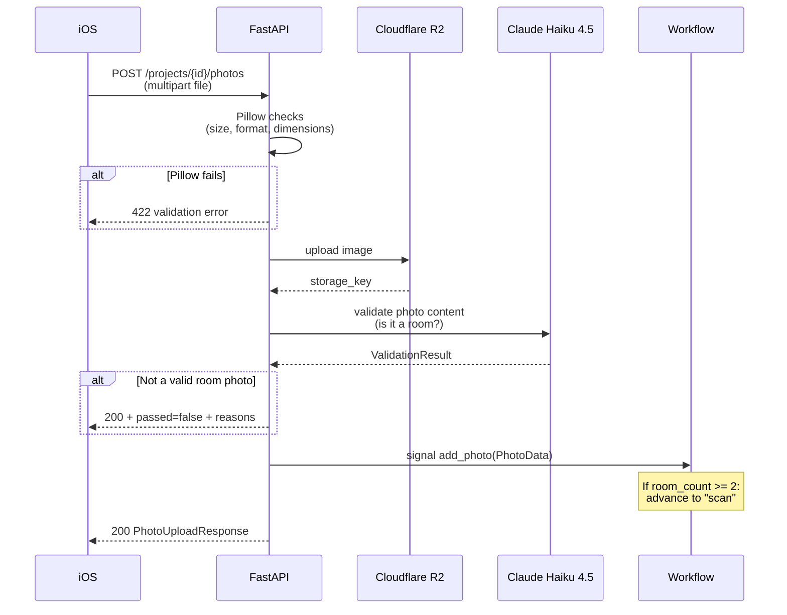

---

## iOS Architecture (T1)

### SPM Package Dependency Graph

8 local SPM packages with a clean dependency tree. The app target depends on all packages; UI packages depend on RemoModels and RemoNetworking.

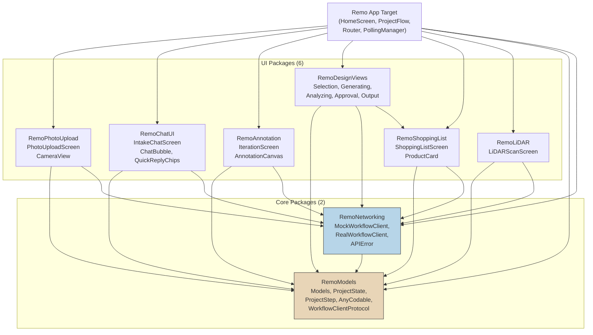

### Navigation Flow

`ProjectStep` drives the entire navigation. The `ProjectRouter` maps each step to its screen view, and `ProjectFlowScreen` pushes screens onto the `NavigationStack` when `ProjectState.step` changes.

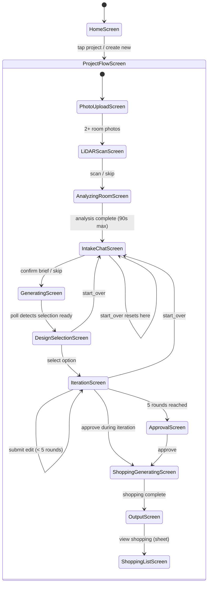

### Data Flow: Polling + State Update

Shows how backend state flows through the system. For async steps (generation, analyzing), `PollingManager` polls `GET /projects/{id}` every 2s. For intake chat and shopping, SSE streaming delivers real-time deltas. The `WorkflowState` DTO is decoded, `ProjectState.apply()` maps it into the `@Observable` state, and SwiftUI views reactively update.

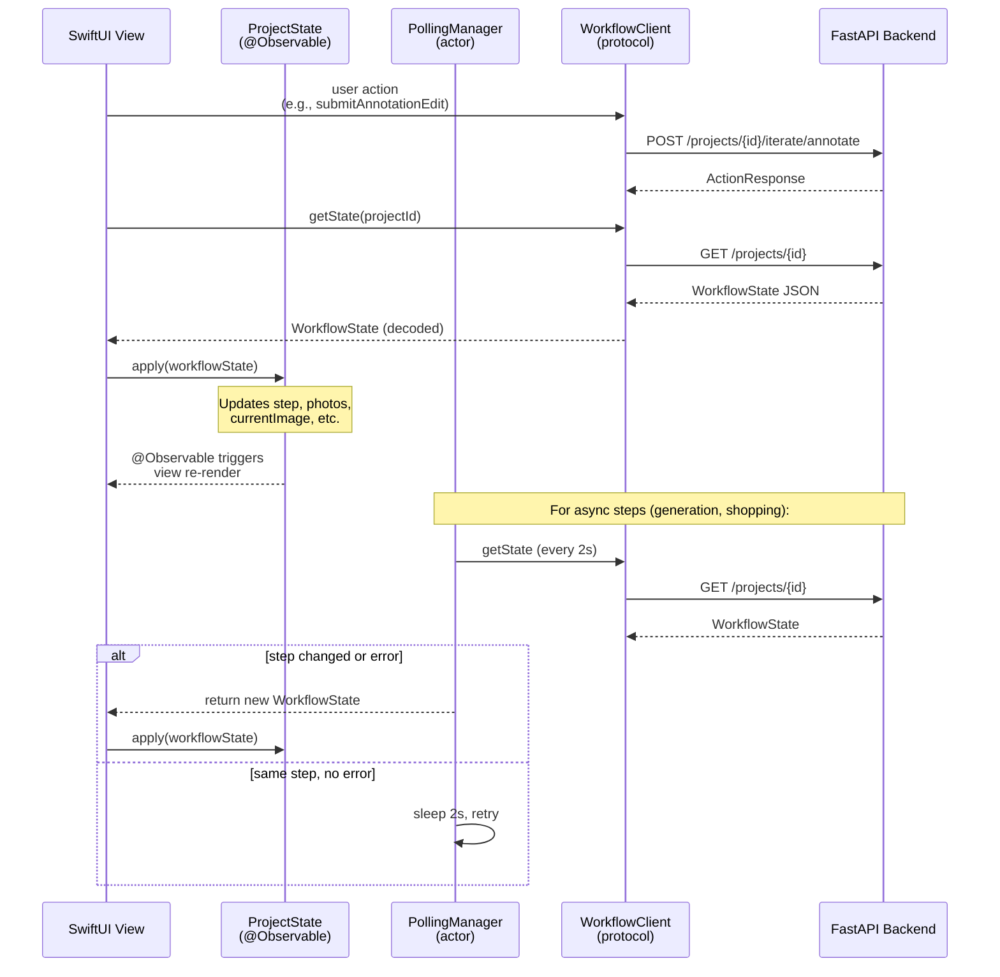

### Protocol Injection Architecture

All views depend on `WorkflowClientProtocol`, never a concrete implementation. `RealWorkflowClient` makes HTTP calls (+ SSE streaming) to the FastAPI backend. `MockWorkflowClient` provides hardcoded responses for SwiftUI previews and tests. The swap happens in one line in `RemoApp`.

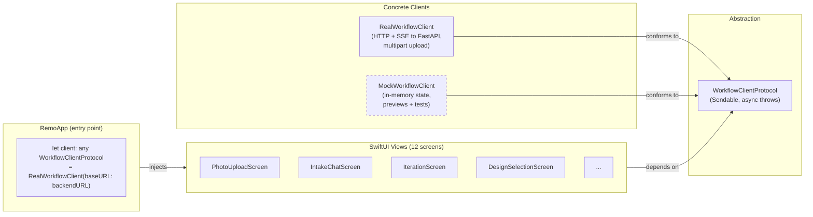

### Error Handling Flow

The codebase uses two error handling patterns: screen-level `@State errorMessage` alerts for user actions, and a global `ErrorOverlay` on `ProjectFlowScreen` for workflow-level errors from the backend.

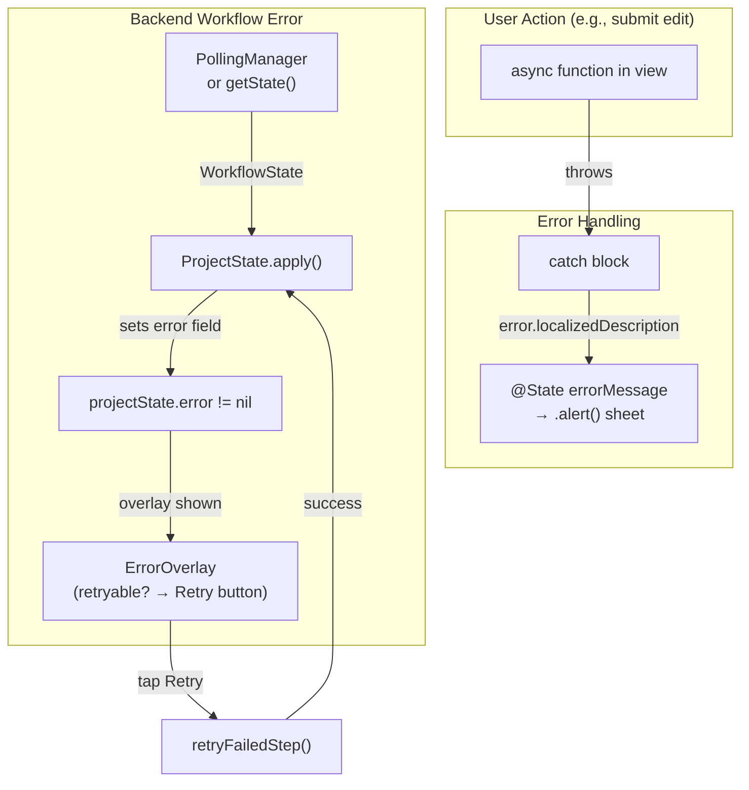
