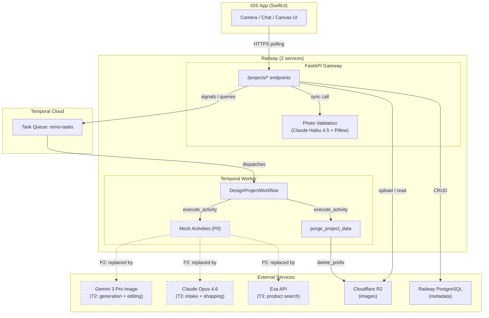
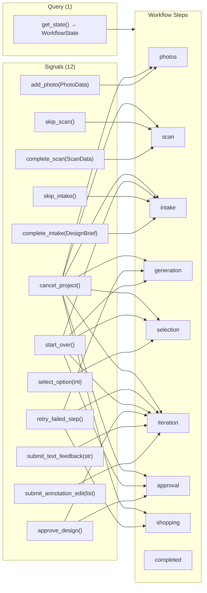
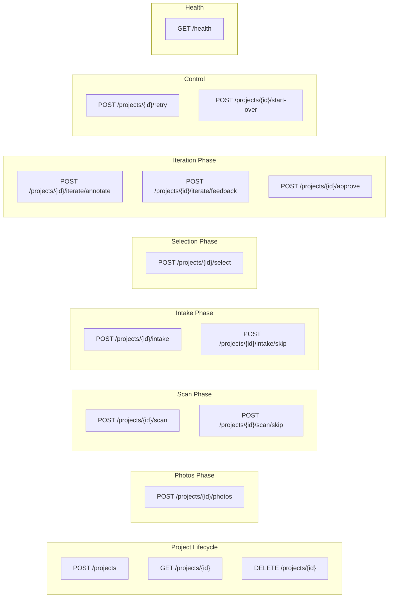

# Architecture Diagrams

Mermaid diagrams for the Remo backend. Renders on GitHub and in Obsidian.

## System Architecture



## Workflow State Machine

The `DesignProjectWorkflow` drives each design project through a linear pipeline with a restart loop from intake through iteration.

```mermaid
stateDiagram-v2
    [*] --> photos

    photos --> scan : 2+ room photos added
    scan --> intake : complete_scan / skip_scan

    state "Restart Loop" as loop {
        intake --> generation : complete_intake / skip_intake
        generation --> selection : generate_designs succeeds
        generation --> generation_error : ActivityError
        generation_error --> generation : retry_failed_step
        selection --> iteration : select_option(index)
        iteration --> iteration : submit_annotation_edit / submit_text_feedback
        iteration --> iteration_error : ActivityError or ValueError
        iteration_error --> iteration : retry_failed_step
        iteration --> approval : 5 rounds reached (unapproved)
        iteration --> shopping : approve_design (during iteration)
        approval --> shopping : approve_design
    }

    intake --> intake : start_over resets here
    generation --> intake : start_over
    generation_error --> intake : start_over
    selection --> intake : start_over
    iteration --> intake : start_over
    iteration_error --> intake : start_over
    approval --> intake : start_over

    shopping --> shopping_error : ActivityError
    shopping_error --> shopping : retry_failed_step
    shopping --> completed : generate_shopping_list succeeds
    completed --> [*] : 24h purge timer

    note right of abandoned
        Every _wait() call has a 48h
        abandonment timeout. If any phase
        stalls (no user action for 48h),
        R2 purge runs, then workflow
        enters "abandoned" state.
    end note

    photos --> abandoned : 48h timeout + R2 purge
    scan --> abandoned : 48h timeout + R2 purge
    intake --> abandoned : 48h timeout + R2 purge
    generation_error --> abandoned : 48h timeout + R2 purge
    selection --> abandoned : 48h timeout + R2 purge
    iteration --> abandoned : 48h timeout + R2 purge
    iteration_error --> abandoned : 48h timeout + R2 purge
    approval --> abandoned : 48h timeout + R2 purge
    shopping_error --> abandoned : 48h timeout + R2 purge

    photos --> cancelled : cancel_project + R2 purge
    scan --> cancelled : cancel_project + R2 purge
```

## Signal & Query Map

All interactions with the workflow happen via Temporal signals (fire-and-forget) and queries (synchronous read).



## API Endpoint Map



## Edit System (Annotation-First)

The iteration loop uses a single `edit_design` activity that accepts either annotation regions or text feedback. This replaces the previous dual-activity model (inpaint + regen).


## Abandonment & Purge Mechanism

Every user-facing wait in the workflow uses `_wait()`, which wraps `workflow.wait_condition()` with a **48-hour abandonment timeout**. If the user takes no action for 48h at any phase, the workflow:

1. Runs `purge_project_data` (best-effort R2 cleanup via `delete_prefix`)
2. Raises `_AbandonedError`
3. Sets `step = "abandoned"` and the workflow completes

The 10 wait points that carry this timeout:

| Phase | Waiting for |
|-------|-------------|
| `photos` | 2+ room photos |
| `scan` | scan data or skip |
| `intake` | design brief or skip |
| `generation` (error) | retry or start_over |
| `selection` | option selected or start_over |
| `iteration` | edit action, approve, or start_over |
| `iteration` (ActivityError) | retry or start_over |
| `iteration` (ValueError) | retry or start_over |
| `approval` | approve or start_over |
| `shopping` (error) | retry |

Additionally, `cancel_project` triggers R2 purge immediately, and `completed` runs a 24h purge timer (not abandonment — the workflow reached success).


## Data Flow: Photo Upload


