# Agent Workflow Architecture

This document describes the enhanced intake agent workflow as implemented in the `team/ai/agent-enhancement` branch. It covers the full pipeline from photo upload through shopping list generation, with focus on the Designer Brain (eager photo analysis) and room intelligence threading.

---

## 1. High-Level Pipeline

The workflow runs as a single Temporal workflow instance per project (`DesignProjectWorkflow`). The key enhancement is eager photo analysis running in parallel with the LiDAR scan.

```mermaid
flowchart TD
    subgraph "Phase 1: Photo Upload"
        A[User uploads 2+ room photos] --> B{2+ room photos?}
        B -->|No| A
        B -->|Yes| C["🔥 Fire read_the_room immediately<br/>(non-blocking)"]
    end

    subgraph "Phase 2: Parallel Execution"
        C --> D["analyze_room_photos<br/>Claude Opus 4.6<br/>⏱ 15-45s typical"]
        C --> E["LiDAR Scan<br/>⏱ 30-120s typical"]
        D -->|RoomAnalysis| F["_enrich_context()<br/>(merge LiDAR + photos)"]
        E -->|ScanData| F
        E -->|skip_scan| G[No dimensions]
        D -->|timeout/failure| G
    end

    subgraph "Phase 3: Intake Conversation"
        F --> H["_resolve_analysis(timeout=90)<br/>with asyncio.shield()"]
        G --> H
        H -->|RoomContext available| I["Intake Agent<br/>with hypothesis injection"]
        H -->|No context| J["Intake Agent<br/>from blank slate"]
        I --> K{draft_design_brief?}
        J --> K
        K -->|No, interview_client| I
        K -->|Yes| L[DesignBrief]
    end

    subgraph "Phase 4: Generation → Shopping"
        L --> M["generate_designs<br/>Gemini 3 Pro"]
        M --> N[User selects option]
        N --> O["Iteration loop<br/>(up to 5 edits)"]
        O --> P[User approves]
        P --> Q["generate_shopping_list<br/>with RoomContext"]
        Q --> R[Shopping List]
    end

    style C fill:#ff9,stroke:#333
    style D fill:#fda,stroke:#333
    style I fill:#afd,stroke:#333
    style Q fill:#adf,stroke:#333
```



### Key Design Decisions

| Decision | Rationale |
|----------|-----------|
| `workflow.start_activity()` for eager launch | Replay-safe Temporal pattern; records scheduling in event history |
| `asyncio.shield()` in `_resolve_analysis` | Prevents `asyncio.wait_for` from cancelling the activity on timeout; slow responses can still be collected later |
| 90s analysis timeout before intake | iOS shows "Analyzing Room" screen while waiting; matches activity's `start_to_close_timeout` |
| `_build_room_context()` LiDAR-only fallback | If analysis fails, LiDAR dimensions still reach intake as a safety net |
| Analysis errors are silent | Never set `self.error`, never show error UI to user — graceful degradation |
| `_build_room_context()` is a workflow method, not activity | Deterministic merge of photo analysis + LiDAR; no I/O, no serialization overhead |

---

## 2. Eager Photo Analysis (`read_the_room`)

The `analyze_room_photos` activity sends room photos to Claude Opus 4.6 for structured analysis **before** the intake conversation begins.

```mermaid
flowchart LR
    subgraph Input
        P1[Room photo URLs]
        P2[Inspiration photo URLs]
        P3[Inspiration notes]
    end

    subgraph "analyze_room_photos Activity"
        R1["resolve_urls()<br/>(R2 keys → presigned URLs)"]
        R2["load_prompt()<br/>(read_the_room.txt)"]
        R3["build_messages()<br/>(multimodal image blocks)"]
        R4["Claude Opus 4.6<br/>tool_choice: analyze_room<br/>⏱ max 90s"]
        R5["extract_analysis()<br/>→ dict"]
        R6["build_room_analysis()<br/>→ RoomAnalysis"]
    end

    subgraph Output
        O1["AnalyzeRoomPhotosOutput<br/>.analysis: RoomAnalysis"]
    end

    P1 --> R1
    P2 --> R1
    P3 --> R3
    R1 --> R3
    R2 --> R4
    R3 --> R4
    R4 --> R5
    R5 --> R6
    R6 --> O1
```



### RoomAnalysis Structure

```
RoomAnalysis
├── Identity: room_type, room_type_confidence, estimated_dimensions, layout_pattern
├── Observations
│   ├── lighting: LightingAssessment (direction, intensity, gaps)
│   ├── furniture: list[FurnitureObservation] (item, condition, keep_candidate)
│   ├── architectural_features, flooring, existing_palette, overall_warmth
│   └── circulation_issues
├── Inferences
│   ├── style_signals
│   ├── behavioral_signals: list[BehavioralSignal] (observation → inference → implication)
│   └── tensions
├── Synthesis: hypothesis, strengths, opportunities
└── Meta: uncertain_aspects (what photos can't tell), photo_count
```

### 7-Step Observational Protocol (read_the_room.txt)

1. **Read the Light** — direction, intensity, time-of-day clues, color temperature
2. **Read the Furniture** — condition/wear reveals where life happens; arrangement reveals actual vs intended use
3. **Read the Architecture** — features the space honors or fights against
4. **Read the Behavior** — toys, pet beds, work setups, book stacks — the room is a diary
5. **Read the Tensions** — where the space is at war with itself (quality mismatch, palette conflict)
6. **Form the Hypothesis** — synthesize into 2-3 sentence assessment
7. **Flag Uncertainties** — what can't be determined from photos alone

---

## 3. Intake Agent Flow

The intake agent is a multi-turn conversation with Claude Opus 4.6. **Important**: intake is NOT orchestrated as a Temporal activity by the workflow. Instead, the API layer (`projects.py`) calls `_run_intake_core()` directly on each user message, managing conversation state in an API-side session. When the conversation produces a final `DesignBrief`, the API sends a `complete_intake` signal to the workflow. The workflow only *waits* for this signal — it never invokes the intake activity.

```mermaid
flowchart TD
    subgraph "Intake Agent Input (IntakeChatInput)"
        I1[user_message]
        I2[conversation_history]
        I3["mode: quick | full | open"]
        I4["project_context:<br/>• room_photos<br/>• inspiration_photos<br/>• previous_brief<br/>• room_analysis"]
    end

    subgraph "System Prompt Assembly"
        S1["intake_system.txt<br/>(translation engine, DIAGNOSE,<br/>question bank, room guidance)"]
        S2["{mode_instructions}<br/>quick ~3 turns / full ~10 / open ~15"]
        S3["{room_analysis_section}<br/>hypothesis + observations<br/>+ uncertain aspects<br/>+ HYPOTHESIS CORRECTIONS"]
        S4["GATHERED SO FAR<br/>(previous_brief context)"]
        S1 --> SP[Complete System Prompt]
        S2 --> SP
        S3 --> SP
        S4 --> SP
    end

    subgraph "Claude Opus 4.6 Call"
        SP --> API["messages.create()<br/>model: claude-opus-4-6<br/>tool_choice: any<br/>max_tokens: 4096"]
        I1 --> MSG["build_messages()<br/>(with photos on turn 1)"]
        I2 --> MSG
        I4 --> MSG
        MSG --> API
        TOOLS["INTAKE_TOOLS:<br/>• interview_client<br/>• draft_design_brief"] --> API
    end

    subgraph "Response Processing"
        API --> EXT["extract_skill_call()"]
        EXT -->|interview_client| INT["Build partial response<br/>+ optional partial_brief_update<br/>+ domains_covered"]
        EXT -->|draft_design_brief| DRF["Build final DesignBrief<br/>+ summary message<br/>+ confirmation options"]
        EXT -->|no tool call| FBK["Fallback: extract text"]
    end

    subgraph "Server-Side Enforcement"
        INT --> CHK{"turn >= max_turns?"}
        CHK -->|Yes| FORCE["Force is_summary = True<br/>Use previous_brief as fallback"]
        CHK -->|No| OUT
        DRF --> OUT
        FBK --> OUT
        FORCE --> OUT
    end

    subgraph "Output (IntakeChatOutput)"
        OUT --> O1[agent_message]
        OUT --> O2["options: QuickReplyOption[]"]
        OUT --> O3[is_open_ended]
        OUT --> O4["progress: 'Turn 2 of ~4 — 5/11 domains'"]
        OUT --> O5[is_summary]
        OUT --> O6["partial_brief: DesignBrief | None"]
    end

    style S3 fill:#fda,stroke:#333
    style FORCE fill:#fcc,stroke:#333
```



### Skill Tool Schema

| Tool | Purpose | Key Fields |
|------|---------|------------|
| `interview_client` | Ask design-informed questions | `message`, `options`, `is_open_ended`, `partial_brief_update`, `domains_covered` |
| `draft_design_brief` | Produce final elevated brief | `message`, `options`, `design_brief` (required) |

### DesignBrief Fields (11 + 4 new)

**Original**: room_type, occupants, pain_points, keep_items, style_profile (lighting, colors, textures, clutter_level, mood), lifestyle, constraints, inspiration_notes

**New (Designer Brain)**: emotional_drivers, usage_patterns, renovation_willingness, room_analysis_hypothesis

### Turn Budget & Modes

| Mode | Max Turns | Typical Interview | Brief Turn |
|------|-----------|-------------------|------------|
| quick | 4 | 2-3 turns | Turn 3-4 |
| full | 11 | 7-9 turns | Turn 8-11 |
| open | 16 | 10-14 turns | Turn 11-16 |

Server-side enforcement: if `turn_number >= max_turns` and the model chose `interview_client`, the output is forced to `is_summary = True` with the accumulated `previous_brief` as fallback.

---

## 4. Room Intelligence in Shopping Pipeline

Room context flows through all 5 shopping pipeline stages.


### Per-Category Size Constraints

When room dimensions are available, `_compute_room_constraints()` calculates:

| Category | Constraint Logic |
|----------|-----------------|
| Sofa | max width ~75% of longer usable wall |
| Coffee table | ~2/3 of max sofa width |
| Rug | width ~80% shorter wall, length ~70% longer wall |
| Dining table | room minus 1.8m total clearance (0.9m per side for chairs) |
| Floor lamp | max height = ceiling - 0.3m |

### Dimension Parsing

`_parse_product_dims_cm()` handles multiple formats:
- `"84x36x32 inches"` → (213.4, 91.4, 81.3) cm
- `"213x91cm"` → (213.0, 91.0, 0.0) cm
- `"8x10"` (rug) → (243.8, 304.8, 0.0) cm — **feet assumed for rugs** (US convention)
- `"8x10"` (non-rug) → (20.3, 25.4, 0.0) cm — inches assumed for other furniture

### Flag-Don't-Gate Pattern

Dimension filtering **annotates** products but never removes them:
- `room_fit = "fits"` — product within category limit
- `room_fit = "tight"` — within 115% of limit (near edge)
- `room_fit = "too_large"` — exceeds 115% of limit

Downstream `apply_confidence_filtering()` uses these annotations to downgrade `fit_status` but keeps products visible.

---

## 5. Error Handling & Graceful Degradation


### Failure Matrix

| Failure | User Impact | Recovery |
|---------|-------------|----------|
| `read_the_room` retries exhausted | None (silent) | Intake starts from blank slate; LiDAR still passes through |
| Analysis still running at intake start | iOS shows "Analyzing Room" (90s max) | Intake waits; if 90s exceeded, starts with LiDAR-only context |
| LiDAR parse fails | None | Photo-only analysis preserved |
| Both analysis AND LiDAR fail | None | Intake starts from blank slate — no regression |
| Zero/negative room dimensions | None | `_compute_room_constraints()` returns `{}`, skips category limits |
| Empty constraints dict | None | `_format_room_constraints_for_prompt()` omits limits section |
| Product dimensions unparseable | None | Product passes through filter unchanged |

---

## 6. Data Flow Summary

```mermaid
sequenceDiagram
    participant User
    participant API as FastAPI
    participant WF as Workflow
    participant RTR as read_the_room
    participant Intake as Intake Agent
    participant Gen as Generation
    participant Shop as Shopping

    User->>API: Upload 2+ room photos
    API->>WF: add_photo signals

    WF->>RTR: start_activity (eager, non-blocking)
    Note over WF,RTR: Runs during scan phase

    User->>API: Complete/skip LiDAR scan
    API->>WF: complete_scan / skip_scan signal

    WF->>WF: _enrich_context() merge

    WF->>WF: _resolve_analysis() (30s shield timeout)
    RTR-->>WF: RoomAnalysis (if ready)

    Note over WF: Build RoomContext

    loop Intake turns (API-managed, not workflow-managed)
        User->>API: Send message
        API->>Intake: _run_intake_core() with room_analysis in project_context
        Intake->>Intake: System prompt with hypothesis injection
        Intake-->>API: IntakeChatOutput (partial_brief or final brief)
    end

    API->>WF: complete_intake signal (DesignBrief)

    WF->>Gen: GenerateDesignsInput + DesignBrief
    Gen-->>WF: 2 design options

    User->>API: Select + iterate
    User->>API: Approve

    WF->>Shop: GenerateShoppingListInput + RoomContext
    Note over Shop: Room constraints → extraction → search → score → filter
    Shop-->>WF: Shopping list with fit annotations
```



---

## 7. File Inventory

| File | Role | Owner |
|------|------|-------|
| `app/activities/analyze_room.py` | read_the_room activity (Claude Opus 4.6) | T3 |
| `app/activities/intake.py` | Intake chat activity with hypothesis injection | T3 |
| `app/activities/shopping.py` | Shopping pipeline with room intelligence | T3 |
| `app/workflows/design_project.py` | Eager analysis orchestration + context enrichment | T0 |
| `app/models/contracts.py` | RoomAnalysis, RoomContext, DesignBrief models | T0 |
| `prompts/read_the_room.txt` | 7-step observational protocol | T3 |
| `prompts/intake_system.txt` | Enhanced intake prompt with room analysis section | T3 |
| `prompts/item_extraction.txt` | Extraction prompt with room constraints | T3 |
| `prompts/product_scoring.txt` | Scoring prompt with dynamic weights | T3 |

---

## 8. Test Coverage

| Area | Tests | File |
|------|-------|------|
| analyze_room unit tests | 24 | `tests/test_analyze_room.py` |
| Intake unit tests | 113 | `tests/test_intake.py` |
| Shopping unit tests | 181 | `tests/test_shopping.py` |
| Workflow tests | 79 | `tests/test_workflow.py` |
| Contract tests | 150 | `tests/test_contracts.py` |
| **Total on branch** | **1251 collected** | |

Note: Test counts include both pre-existing tests and tests added by this branch. The agent enhancement branch added ~100 new tests across these files.
